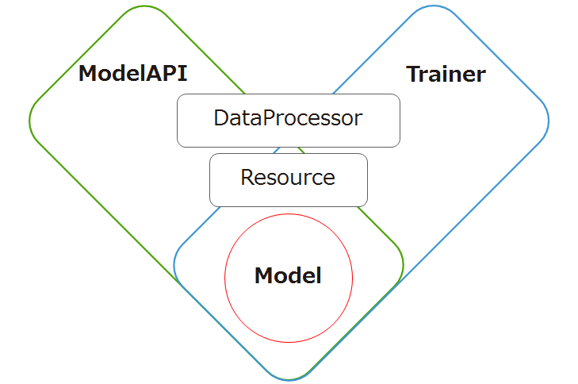

# Machine Learning In Application

Practical implemantation of Machine Learning in the Application.  

## Architecture

* Model: Machine Learning Model
* Trainer: Training the model. So training process (loss, optimizer) is separated from Model.
* Model API: Interface between the Model and Application.
* DataProcessor: Load the data and preprocess it. It is used in Trainer and ModelAPI.
* Resource: It manages the parameters for Trainer, Model and DataProcessor.

## Demo Application

handwritten number recognizer by Chainer.

You can deploy this application by docker.

Please refer [this](https://devcenter.heroku.com/articles/container-registry-and-runtime) tutorial to deploy the application.

* `heroku plugins:install heroku-container-registry`
* `heroku container:login`
* `git clone https://github.com/icoxfog417/machine_learning_in_application.git`
* `heroku create`
* `heroku container:push web`
* `heroku open`
